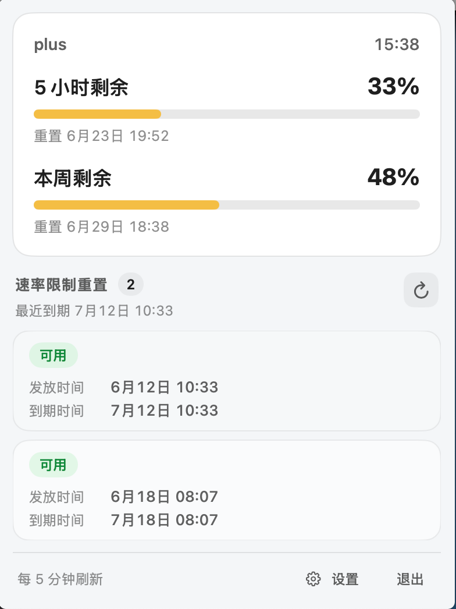
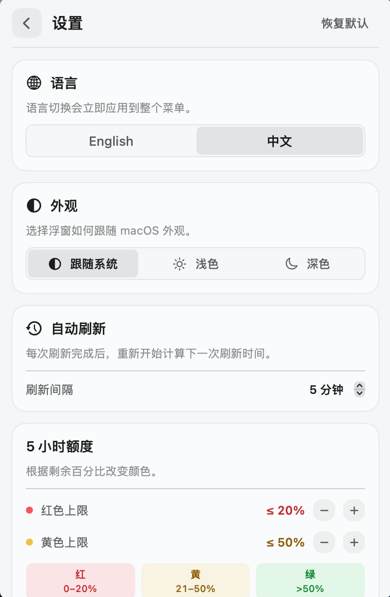

# Codex Usage Monitor

一个原生 macOS 菜单栏工具，用于查看 Codex 的短周期/周用量，以及可用的 rate-limit reset credits。点击菜单栏图标即可打开监控面板；应用默认不显示 Dock 图标。

## 界面预览

<table>
  <tr>
    <th>用量面板</th>
    <th>设置面板</th>
  </tr>
  <tr>
    <td></td>
    <td></td>
  </tr>
</table>

## 功能

- 从 `~/.codex/auth.json` 读取当前 Codex 登录信息。
- 从本地 JWT 声明读取会员级别，并以用量接口返回值优先。
- 展示 5 小时与周用量的剩余百分比和重置时间。
- 展示 rate-limit reset credits、发放时间、到期时间和最近到期时间。
- 使用 392pt 紧凑 Popover：短日期、纵向 reset 卡片、等宽数字和可滚动记录列表，适合菜单栏快速扫读。
- 使用自定义的绿色 C 形仪表应用图标，并为 Finder、Dock 和系统应用列表提供完整的 macOS 多尺寸图标。
- 在菜单栏浮窗内提供设置页，可即时切换 English/中文并自动保存。
- 外观支持跟随系统、浅色和深色三种主题，切换后立即应用并自动保存。
- 每次打开菜单栏浮窗都会主动刷新；自动刷新间隔可在设置中配置为 1～1440 分钟。
- 5 小时和每周额度分别支持红/黄阈值；默认红色 ≤20%、黄色 ≤50%、绿色 >50%。
- 每条可用 reset credit 按剩余天数着色；默认红色 ≤3 天、黄色 ≤7 天、绿色 >7 天。
- 启动时刷新，也支持打开浮窗刷新、手动刷新和自定义间隔的自动刷新。
- 两个远端接口独立容错：一个失败时仍保留另一个接口的数据。
- 提供加载、部分失败、未登录和空数据状态。

## 数据来源

应用只向 `https://chatgpt.com` 发起以下请求：

- `GET /backend-api/wham/usage`：会员级别和用量窗口。
- `GET /backend-api/wham/rate-limit-reset-credits`：rate-limit reset credits。

请求使用 `auth.json` 中的 `access_token` 和 `account_id`，并包含 Codex Desktop 所需的请求头。凭据不会被复制到其他文件，也不会写入日志。界面中的更新时间是本次刷新完成的本机时间。

> 这些是 ChatGPT/Codex 的内部接口，并非稳定的公开 API。服务端字段或路径变化时，上半区或下半区可能降级为错误提示；解析和容错逻辑集中在 `CodexAPIClient.swift` 中，便于后续调整。

## 系统要求

- macOS 14 或更高版本
- Xcode 16 / Swift 6
- 已经通过 Codex CLI 或 Codex Desktop 登录，且 `~/.codex/auth.json` 存在

## 构建与运行

```bash
./script/build_and_run.sh
```

脚本会构建应用、生成 `dist/Codex Usage Monitor.app`，然后作为菜单栏应用启动。Codex 桌面端的 Run 按钮也已通过 `.codex/environments/environment.toml` 指向该脚本。

其他模式：

```bash
./script/build_and_run.sh --verify
./script/build_and_run.sh --logs
./script/build_and_run.sh --telemetry
./script/build_and_run.sh --debug
./script/build_and_run.sh --snapshot
./script/build_and_run.sh --snapshot-light
./script/build_and_run.sh --snapshot-settings
./script/build_and_run.sh --snapshot-settings-light
./script/build_and_run.sh --snapshot-settings-zh
```

五个 `--snapshot*` 模式使用固定演示数据在本地生成深色/浅色主面板、深色/浅色英文设置页和中文设置页验收图，不读取真实登录文件，也不发起网络请求。

## 应用图标

图标母版位于 `Assets/AppIcon/app-icon-source.png`。工程保留用户选定的原始构图，只在本地清除与画布相连的四角黑底，并生成透明的 1024 px 母版和 macOS `.icns` 文件：

```bash
./script/generate_app_icon.swift \
  Assets/AppIcon/app-icon-source.png \
  Assets/AppIcon
```

`build_and_run.sh` 会把 `Assets/AppIcon/CodexUsageMonitor.icns` 复制进应用包并写入 `Info.plist`。图标生成过程完全在本机完成。

## 设置与持久化

点击底部 `Settings/设置` 可在同一个菜单栏浮窗内进入设置页。语言、主题、自动刷新间隔和阈值保存在 macOS `UserDefaults` 中，修改立即生效，重启应用后继续保留。设置页的 `Reset/恢复默认` 只恢复三组颜色阈值，不会修改当前语言、主题或刷新间隔。

主动刷新和自动刷新共用同一个调度基准：每次刷新完成都会记录完成时间，并从该时间开始按当前配置计算下一次自动刷新。修改间隔时，也会基于最近一次刷新时间立即重新排程。

阈值采用包含上限的规则：

- 剩余值 `≤ 红色上限`：红色。
- 剩余值大于红色上限且 `≤ 黄色上限`：黄色。
- 剩余值 `> 黄色上限`：绿色。

应用会始终保证红色上限小于黄色上限。

## 测试

```bash
swift test
```

测试只使用临时文件、模拟凭据和本地 JSON，不访问真实 `auth.json`，也不发起网络请求。

## 许可证

本项目采用 [MIT License](LICENSE)，允许自由使用、复制、修改、合并、发布、分发、再许可和销售，但分发时必须保留原版权声明与许可声明。除非文件中另有说明，本仓库中的代码与资源文件均适用该许可证。

## 安全说明

- 应用不会显示、持久化或记录 token 和 account ID。
- HTTP 错误只显示状态码，不显示可能包含敏感信息的响应正文。
- 登录文件读取限制为普通文件且最大 2 MiB。
- 当前工程不启用 App Sandbox，因为菜单栏应用需要读取用户主目录下现有的 `~/.codex/auth.json`。如需分发到 Mac App Store，建议改为由用户显式选择文件并保存 security-scoped bookmark。
